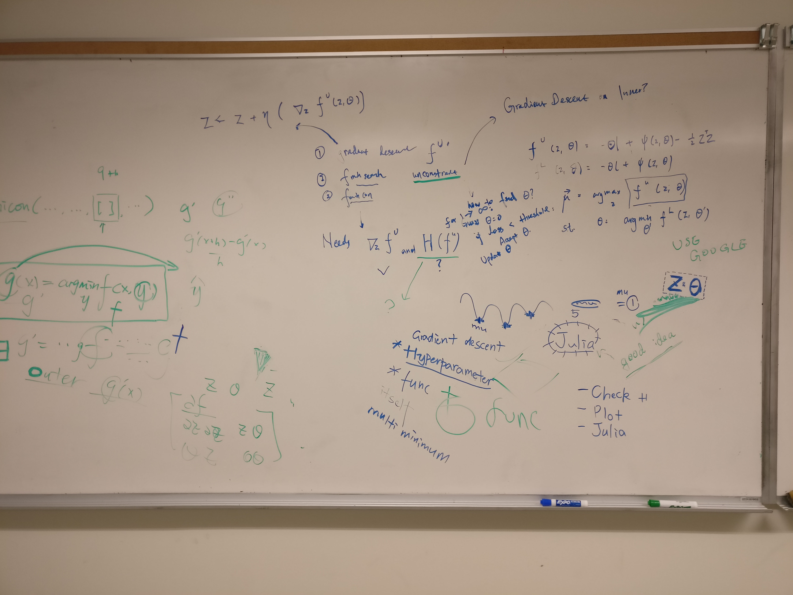

##### 5.1

+ research paper
    + idea
        + probability of losses given a credit portfolio L
        + L: set of bonds, with interest
        + L is probabilistic model 
    + L(Z, \Sigma): 2 normal(0, 1) distribution 
        + first 2 chapters
        + biggest loss: everything defaults
        + also loss: reduce credit rating (AA -> A)
        + gain: increase credit rating
    + try to estimate with monte carlo 
    ```
    P(L(Z, \Sigma) > e) = E(1_{L(Z, \Sigma) > \epsilon})
    \approx \frac{1}{MN} \sum_{n=1}^N \sum_{n=1}^M 1_{L(Z, \Sigma) > \epsilon}
    ```
    + problem, MC runs too slowly
+ importance sampling 
    + how fast MC runs depends on variance
        + i..e Var_f(g(x))
    ```
    E(f(x)) = \int g(x) f(x) dx
    = \int \frac{g(x) f(x)}{\hat{f}(x)} \hat{f}(x) dx
    = E_{\hat{f}}{ \frac{g(x) f(x)}{\hat{f}(x)} }
    ```
    + potential source of error 
        + 2 MC on lhs and rhs, they should be approximately equal
        + but there seems to be some consistent bias, not as close as wed expect
    + importance sampling reduce variance 
        + var_{\hat{f}}{\frac{g(x) f(x)}{\hat{f}(x)}}
+ variance reduction method
    + why variance reduction for glasserman li doesnt work
+ 2-state

##### 5.21

+ stock return
    + log normal model
    + not that accurate, underestimate large losses
    + want thicker tails
+ motivation for H
    + P(y \leq H_{c(n)}^n)
+ why not model the covariance matrix and in this way sampling uses only 1 layer
    + 2 level useful
+ numerical analysis computing resources 
    + loginto appS0, appS1, ... then login to
    + compS0, compS1, ...
        + `ssh kjr@compS0.cs.toronto.edu`
+ TODOS:
    + check 2 simple MC algorithm 2.1 2.2 yield same result 
        + the result are consistently different, but try 
            + run on larger sample sizes 
            + try run 2 algorithm on the same saved parameters, maybe they are different and somehow, however unlikely, effect the result
        + also some MC estimate in 1 run yield 0 ??!!

##### 5.28

+ TODO:
    + verify 2.1 2.2 again with CI, on large sample sizes
    + re-read glasserman-li
+ since model is simulated, can compute the real statistics not relying on sampling
    + try different sample size -> observe varied variance ...


##### 6.10 

+ Readings 
    + glasserman and li 
        + likelihood function 
        + MC simulation 
    + chapter 3, (maybe 4)
+ Look at Glasserman Li impl
    + see if the likehood is adjusted ... properly in (Glasserman-LI - 21)


##### 6.25

+ look carefully at likelihood for the outer level change of normal distribution
    + see if expected value of likelihood sum up to 1
+ points 
    + changing `weights = EAD .* LGC` to `weights = LGC` only is not the solution 
        + varying in tail `l=0` to `l=0.99` doesn't change the shifted mean `mu`
        + but the original algorithm seems to have extreme `mu` (i.e. -2) even when `l=0`, (should expect no shift)
            + so a problem with finding the `mu`
            + TODO: test for this, using original weights, vary tail, expect change in shifted mu 
    + values of `mu`, i.e. shifted mean for `Z ~ N(mu, I_S)` effect MC estimates
        + maybe because number of samples for Z is not sufficient to offset the shift
        + so need to increase the number of samples for Z, does it fix the shifting problem?
    + glasserman&li works when not shifting `mu ~ 0`
        + corresponds to adam sturge's experiment

+ 2 sources of problem 
    + algorithm for computing shifted mean `mu`
        + effect variance reduction
    + likelihood value not accurate
        + regardless of values of `mu`, likelihood should compensate for the shift,
        + hypothesis: did not do sufficient sampling of `Z`, so that the likelihood does not compensate for the shift
            + yes, more sampling 

##### 7.2

1. even with the wrong `mu`, MC of likelihood should still converge to 1, for large enough sample size for `E` and `Z`
    + test with running the algorithm with large enough iterations, ... after setting the `mu` to 1, 2
2. Investigate more into how `mu` is picked,
    + potential problems
        + `mu` is not a local max, so the method didnt work 
            + verify this by conmputing the gradient and see if the 1st order derivative is 0 and 2nd order gradient <0
        + `mu` is a local max, but not the one we want
            + dunno how
    + run the algorithm with 
        + constarinted optimization with `fmicon`
            + `fmicon` returns OK  `grad` but hessian semi-definite, 2nd derivartive test inconclusive ... maybe saddle points ...
            + note `mu` give back from `fmicon` is determinstic, always this value given the same inputs
            + returned
            ```
            grad =
               1.0e-05 *
               -0.0066
                0.2492
               -0.0301
                0.1389
               -0.0712
               -0.0000
            hessian =
                1.9383   -5.0775   -0.2013   -5.2087    4.1039   -0.0243
               -5.0775   14.5250    0.6483   14.4699  -11.5211    0.0601
               -0.2013    0.6483    0.2917    0.7376   -0.5559    0.0008
               -5.2087   14.4699    0.7376   15.6371  -12.1867    0.0468
                4.1039  -11.5211   -0.5559  -12.1867    9.9649   -0.0368
               -0.0243    0.0601    0.0008    0.0468   -0.0368    0.0006
            mu =
               -0.6788
                2.0342
                0.0677
                2.2176
               -1.8130
            % all positive except 1st 0 -> positive semi-definite -> local min or saddle
            eig(hessian) = 
                    0.0000
                    0.1227
                    0.2592
                    0.3000
                    0.6705
                    41.0052
            ```
        + unconstrainted steepest ascent
    + do some plotting in 1d/2d case

##### 7.4 meeting with kjr on presentation

+ presentation structure
    + MC + IS
        + introduction, definitions 
    + fiannce background
        + definitions
        + copula factor model
    + 2 lvl IS applied to copula factor model
        + rare event simulation ...
        + emphasis on why/how 2 lvl IS works 
        + sketch of algorithm 
    + research problem and approaches
        + downward bias of estimates with Glasserman&Li algorithm
        + need large enough sample for computing `mu` ?
        + `mu` did not find the right one ?


##### 7.9 


+ talk feedback
    + plot: make dots larger, dots color ...
    + solid intro?
        + add some example, estimating pi
    + prepare the talk to know what to say next
    + highlight beginning 
        + interest ...
        + motivation ...
            + definition, about how portfolio made up of loans, not all companies is not gonna pay back, want to know the likelihood of default
    + `mu` symbol used twice ...
        + change first one 
    + background
        + mention adam thesis, wrong result, tie it back
+ todo
    + see `fmincon` ... hessian semi-definite...
    + run longer for likelihood

##### 07.16


+ optimization 
    + read doc for glasserman&li's optimizer
    + read the Goude paper on optimizing max min problem
    + derive 1st/2nd order derivative and use an optimization software with it
+ 


##### 07.23 

+ inner level optimization 
    + optimized value returned is not only `theta` but `theta+error`
    + outer level is `f(z, theta + error)` instead, might not be smooth any more because of the inner level optimization 
    + ideally inner level optimization have analytical gradient
+ mu finding algo: what to do next
    + unconstrained optimization 
    + `max_z f(z, theta)`
        + use newton's method `fminunc` and supply gradient/hessian to outer level 
            + `hat(z) = f(z, hat(theta))`
        + use 1-D newton's method `fminunc` for inner level optimization 
            + `hat(theta) = argmin g(z,theta)`


```
>>>>> fmincon (interior-point):

mu =

    0.6243
   -0.4541
   -2.2364
    1.7449
    1.9662

>>>>> fmincon (sqp):

mu =

    0.3874
   -0.0875
   -2.3366
    1.4583
    2.2036
```


##### 07.30

+ zeneng
    + tried `fminunc` for S=5, l=0, MC estimate not biased,     
    + compared `fminunc` and `fmincon`, two yield similar result
+ sample points around local min and see if shifted mu is local min/max
    + hessian/ finite difference ...
    + change tolerance level...
    + set initial guess to be previous run of algo that starts with 0
+ dot plots for different algorithm and see if they alleviate the bias
+ adam 
    + took gaussian mixture (mixture=2)'s shifted 


##### 07.04

+ try different tail `l` larger than 0.2
+ compare with gaussian
+ sample points around local min and see if shifted mu is local min/max
+ try higher dimension for S